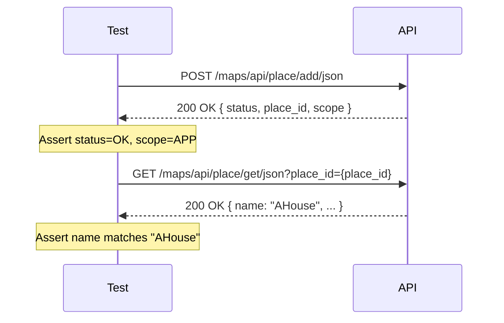

The Add Place scenario is a `Scenario Outline` that sends a POST request to create a new place, asserts the response fields, then performs a follow-up GET request to confirm the returned `place_id` maps back to the expected place name.

**Tags:** `@AddPlace` `@Regression`

## The scenario

```gherkin
@AddPlace @Regression
Scenario Outline: Verify is Place is being successfully added using AddPlaceAPI
    Given add Place Payload with "<name>" "<language>" "<address>"
    When user calls "addPlaceAPI" with "POST" http request
    Then the API call got success with status code 200
    And "status" in response body is "OK"
    And "scope" in response body is "APP"
    And verify place_Id created maps to "<name>" using "getPlaceAPI"

    Examples:
        | name   | language | address            |
        | AHouse | English  | World Cross Center |
```

## Step-by-step breakdown

<Steps>
  <Step title="Given add Place Payload with &quot;AHouse&quot; &quot;English&quot; &quot;World Cross Center&quot;">
    Builds the request body as a POJO (`AddPlace`) and populates it with the values substituted from the `Examples` table: `name=AHouse`, `language=English`, `address=World Cross Center`. The remaining fields (`accuracy`, `phone_number`, `website`, `location`, `types`) are set from the test data builder with fixed defaults.
  </Step>
  <Step title="When user calls &quot;addPlaceAPI&quot; with &quot;POST&quot; http request">
    Resolves the endpoint key `addPlaceAPI` to `POST /maps/api/place/add/json?key=qaclick123` from the API resources map, serialises the POJO to JSON, and dispatches the HTTP request using RestAssured. The response is stored for subsequent assertions.
  </Step>
  <Step title="Then the API call got success with status code 200">
    Asserts that the HTTP response status code is `200`. If the code differs, the step fails immediately and subsequent steps are skipped.
  </Step>
  <Step title="And &quot;status&quot; in response body is &quot;OK&quot;">
    Extracts the `status` field from the JSON response body and asserts its value equals `"OK"`.
  </Step>
  <Step title="And &quot;scope&quot; in response body is &quot;APP&quot;">
    Extracts the `scope` field from the JSON response body and asserts its value equals `"APP"`.
  </Step>
  <Step title="And verify place_Id created maps to &quot;AHouse&quot; using &quot;getPlaceAPI&quot;">
    Extracts `place_id` from the Add Place response, then sends a GET request to `/maps/api/place/get/json?key=qaclick123&place_id={place_id}`. Asserts that the `name` field in the GET response equals `AHouse`, confirming the place was stored correctly.
  </Step>
</Steps>

## Request body

```json
{
  "accuracy": 50,
  "name": "AHouse",
  "phone_number": "+20 1234567890",
  "address": "World Cross Center",
  "website": "https://rahulshettyacademy.com",
  "language": "English",
  "location": { "lat": -40.123456, "lng": 40.987654 },
  "types": ["home", "house"]
}
```

Sent to: `POST /maps/api/place/add/json?key=qaclick123`

## Expected response

```json
{
  "status": "OK",
  "place_id": "some_unique_id",
  "scope": "APP",
  "reference": "...",
  "id": "..."
}
```

The `place_id` value is dynamic — it changes with every successful Add Place call. The step definition captures it from this response and uses it immediately in the follow-up GET request.

## Examples table

| name | language | address |
|---|---|---|
| AHouse | English | World Cross Center |

The scenario currently runs once, using the single row above. Add more rows to increase coverage without writing new step definitions.

## End-to-end flow



The scenario validates two things in one pass: that the Add Place API returns the correct response fields, and that the `place_id` it issues can be used to retrieve the same place with the correct name.

<Note>
The GET verification step (`getPlaceAPI`) is the key end-to-end assertion. A response of `status=OK` alone does not confirm the data was persisted — the GET check does.
</Note>
